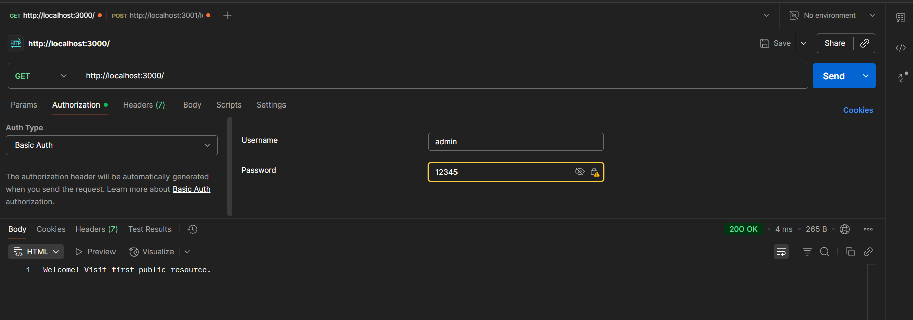
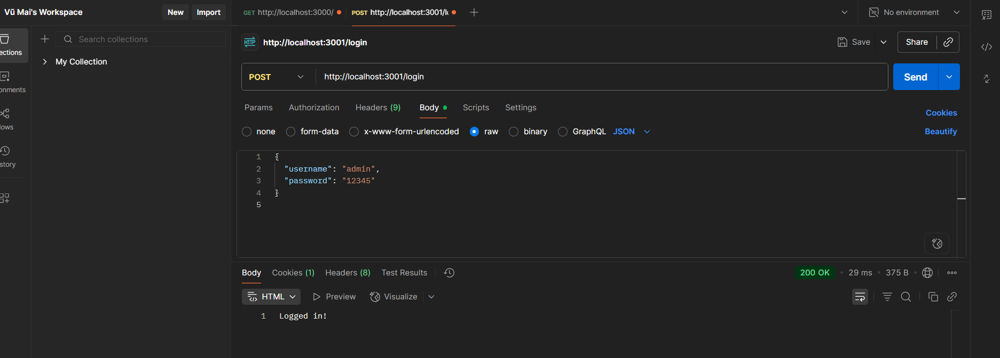
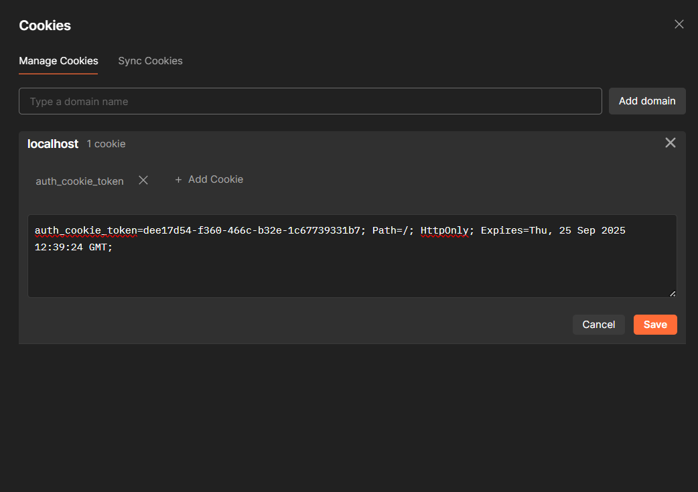
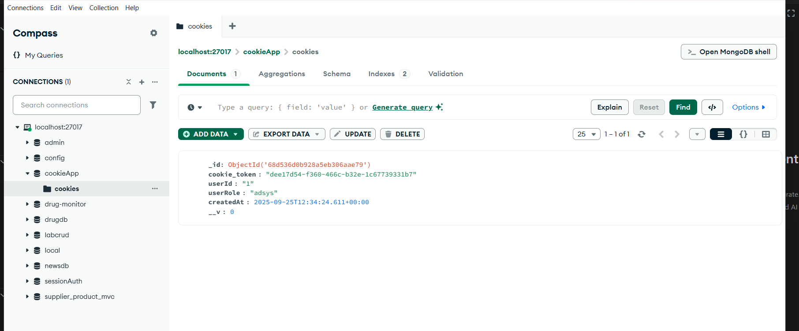

# Simple Auth

## Test với Postman

Ảnh request Login:  
Với phương thức là POST đường dẫn local/login, vào tab body ta chọn raw và nhập vào username và password

Kết quả trả về nếu login thành công

Ảnh cookie được lưu lại trong Postman sau khi login thành công:

Ảnh cookie lưu trong MongoDB:  

